# FacturOCR — Informe Integral del Producto

**Producto:** FacturOCR — SaaS de OCR y gestión de facturas para asesorías contables españolas
**Fecha del informe:** 20 de abril de 2026
**Versión del código:** 0.1.0 (Next.js 16.2.1, pre-producción)
**Ámbito:** Revisión del estado real del código y de la UI a partir del repositorio `invoice-saas` y las capturas en `docs/screenshots_v2/`

---

## 1. Portada

FacturOCR es una aplicación web B2B multi-tenant que permite a una asesoría contable española automatizar la captura, revisión y exportación a programa contable de las facturas de sus clientes. Combina un pipeline OCR (Google Document AI + parse nativo de FacturaE XML) con un flujo editorial de revisión humana, trazabilidad completa y exportación a Sage 50, Contasol y A3asesor.

El presente informe describe el estado del producto **tal como existe hoy** en el repositorio: funcionalidades implementadas, pantallas disponibles, flujo operativo, límites conocidos y demo guiada. No contiene roadmap ni sugerencias de mejora más allá de señalar las limitaciones detectadas.

---

## 2. Resumen ejecutivo

FacturOCR resuelve un problema muy concreto del día a día de una asesoría: los clientes (empresas y autónomos) envían cada mes decenas o cientos de facturas en PDF, imagen o XML, y el gestor debe revisarlas y llevarlas al programa contable. El producto cubre ese circuito de extremo a extremo:

- **Subida**: el propio cliente, el gestor, o el admin de la asesoría pueden subir facturas (drag-and-drop, multi-archivo, con validación de magic bytes y deduplicación por SHA-256).
- **Extracción automática**: un pipeline OCR (Google Document AI para PDF/imagen; fast-xml-parser para FacturaE) extrae emisor, receptor, base, IVA, IRPF y total, y detecta incidencias (duplicados, descuadres, baja confianza).
- **Revisión editorial**: el gestor abre una pantalla split (PDF + formulario) con badges de confianza, validación matemática en tiempo real y sugerencia automática de cuentas contables basada en el plan de cuentas aprendido.
- **Exportación**: el admin genera ficheros CSV (Sage 50, Contasol, A3CON) o XLSX (plantilla oficial A3) con lotes (`ExportBatch`) que guardan un snapshot JSON de cada factura exportada.
- **Trazabilidad y cierres**: todo cambio queda registrado en `AuditLog` e `InvoiceStatusHistory`; los periodos pueden cerrarse/reabrirse, bloqueando modificaciones.
- **Aislamiento multi-tenant**: todos los datos se filtran por `advisoryFirmId`; cada worker solo ve los clientes que tiene asignados; cada client user solo ve sus propias facturas.

El producto está en fase pre-producción: funcional, con datos reales, con tests (55 unit en Vitest y 5 smoke en Playwright), seed demo con PDFs reales subidos a Supabase, headers de seguridad (CSP, HSTS, X-Frame-Options), rate limiting en login y password reset, y validación de magic bytes en uploads.

---

## 3. Visión general del producto

### 3.1 Qué es

FacturOCR es una plataforma SaaS web construida sobre Next.js 16 App Router. Se despliega en Vercel y usa Supabase (PostgreSQL + Storage) como backend de datos y archivos. El OCR se delega a Google Document AI (Invoice Parser), los emails a Resend, y la autenticación a NextAuth v5 con credenciales.

### 3.2 Para quién es

Los destinatarios son:

- **Asesorías contables españolas** que llevan la contabilidad de múltiples clientes y trabajan con los programas contables habituales del mercado español (A3asesor, Sage 50, Contasol).
- **Empresas clientes** de esas asesorías, que pueden subir sus propias facturas desde un portal propio con su usuario, sin correo ni intercambio manual de archivos.

### 3.3 Propuesta de valor

- Reducir a minutos el tiempo desde que una factura llega hasta que está disponible como asiento contable en el programa de contabilidad.
- Eliminar el intercambio manual de PDFs por email entre cliente y asesoría.
- Proporcionar trazabilidad auditable para el cumplimiento normativo (quién cambió qué campo y cuándo).
- Ofrecer exportación en los tres formatos contables más habituales en España.

### 3.4 Stack técnico (verificado en `package.json`)

| Capa | Tecnología | Versión |
|------|------------|---------|
| Framework | Next.js App Router | 16.2.1 |
| React | React + RSC | 19.2.4 |
| ORM | Prisma (adapter `@prisma/adapter-pg`) | 7.5.0 |
| BBDD | PostgreSQL (Supabase) | — |
| Storage | Supabase Storage, bucket `invoices` | — |
| OCR | Google Document AI (Invoice Parser) | API v1 |
| Auth | NextAuth v5 (JWT credentials) | 5.0.0-beta.30 |
| Hash | bcryptjs | 3.0.3 (12 rounds) |
| Email | Resend | 6.9.4 |
| XML | fast-xml-parser | 5.5.10 |
| XLSX | SheetJS (`xlsx`) | 0.18.5 |
| PDF viewer | react-pdf | 10.4.1 |
| CSS | Tailwind v4 | 4.x |
| Validación | Zod | 4.3.6 |
| Tests unit | Vitest | 4.1.4 |
| Tests E2E | Playwright | 1.59.1 |
| PDFs demo | Python reportlab (via `gen-sample-invoice.py`) | — |

### 3.5 Entornos y límites operativos

- Límite de body en Server Actions: **25 MB** (`next.config.ts`, `experimental.serverActions.bodySizeLimit: "25mb"`).
- Headers globales: X-Frame-Options DENY, X-Content-Type-Options nosniff, Referrer-Policy, Permissions-Policy, CSP restrictiva, HSTS (solo en producción).
- Session JWT con `maxAge` 8 h y `updateAge` 1 h (ver `src/lib/auth.ts`).
- Lockout de cuenta tras 3 intentos fallidos durante 15 minutos.
- Rate limiting en login (10 intentos / 15 min) y reset-password (5 / hora), en memoria.

---

## 4. Arquitectura funcional

### 4.1 Roles

El enum `Role` define tres roles (ver `prisma/schema.prisma`):

- **ADMIN** — pertenece a una `AdvisoryFirm`. Ve y gestiona todos los clientes y trabajadores de la firma, facturas, exportaciones, cierres, auditoría, plan de cuentas y ajustes de firma.
- **WORKER** (gestor) — también pertenece a una `AdvisoryFirm`. Ve solo los clientes asignados a él a través de la tabla `WorkerClientAssignment`. Puede subir, revisar, validar y rechazar facturas de esos clientes, y gestionar incidencias.
- **CLIENT** (cliente final) — usuario vinculado a un `Client` concreto mediante `Client.userId`. Ve solo sus propias facturas, puede subir las suyas y reenviar las rechazadas.

### 4.2 Modelos principales (14 modelos en `schema.prisma`)

```
AdvisoryFirm 1───n User ─── (opcional) 1───1 Client
     │                           │
     │                           ├─n WorkerClientAssignment n───1 User (WORKER)
     │                           ├─n Document
     │                           ├─n Invoice
     │                           │    ├─n InvoiceExtraction (OCR raw)
     │                           │    ├─n InvoiceStatusHistory
     │                           │    ├─n InvoiceIssue
     │                           │    ├─n AuditLog
     │                           │    └─n ExportBatchItem ── n:1 ExportBatch
     │                           ├─n AccountEntry   (plan de cuentas por NIF)
     │                           └─n PeriodClosure
     └─n PasswordResetToken
```

### 4.3 Estados de factura

Enum `InvoiceStatus`:

```
UPLOADED → ANALYZING → (PENDING_REVIEW | NEEDS_ATTENTION | OCR_ERROR)
                      → VALIDATED | REJECTED
```

Los estados `ANALYZED` y `EXPORTED` están marcados como **legacy** en `src/lib/invoiceStatuses.ts`: siguen en el enum por compatibilidad, pero el código actual ya no los escribe. La "exportación" no cambia el estado de la factura; se registra en `ExportBatch` / `ExportBatchItem`, y `Invoice.exportBatchId` apunta al último batch como conveniencia para la UI.

### 4.4 Incidencias (`InvoiceIssue`)

Tipos detectados automáticamente por `src/lib/issueDetector.ts`:

- `OCR_FAILED` — todos los campos clave nulos.
- `LOW_CONFIDENCE` — algún campo con confianza < 70 %.
- `MATH_MISMATCH` — `|Base + IVA − Total|` > 2 céntimos.
- `POSSIBLE_DUPLICATE` — por (CIF + nº factura) o (CIF + total + fecha).
- `MANUAL` — creada manualmente por un gestor.

Estados: `OPEN → RESOLVED | DISMISSED`.

### 4.5 Aislamiento multi-tenant

Toda query filtra por `advisoryFirmId` (admin), por `WorkerClientAssignment` (worker), o por `Client.userId` (client). Esto es verificado en cada página server-side del dashboard y en cada server action.

### 4.6 Plan de cuentas aprendido

El modelo `AccountEntry` guarda, por cliente y por NIF: cuenta proveedor, cuenta gasto/ingreso y IVA por defecto. Dos mecanismos lo pueblan:

1. **Importación manual** en `admin/clients/[id]/accounts` (Excel).
2. **Aprendizaje automático** al validar una factura (`worker/review/[id]/actions.ts`, función `parseAndSave`): si al validar hay `issuerCif` + `supplierAccount`/`expenseAccount`, se hace un `upsert` sobre `AccountEntry` para ese `(clientId, nif)`.

Esto permite que, al OCR-ear la siguiente factura del mismo emisor para el mismo cliente, el formulario de revisión pre-rellene automáticamente las cuentas contables.

---

## 5. Funcionalidades actuales

### 5.1 Autenticación y gestión de sesión

- **Login con credenciales** (`/login`), validación Zod, hash bcryptjs 12 rounds.
- **Bloqueo de cuenta** tras 3 intentos fallidos durante 15 minutos (`src/lib/auth.ts`).
- **Rate limiting** adicional en login (10 / 15 min por IP+email) y en reset-password (5/hora) (`src/lib/rateLimit.ts`).
- **Reset de contraseña** con token UUID de 1 hora en `PasswordResetToken`, enviado por Resend.
- **Session JWT** con `maxAge: 8h` y `updateAge: 1h`; claims: `id`, `role`, `advisoryFirmId`.
- **Logout** desde el sidebar.

Evidencia: `src/lib/auth.ts`, `src/app/login/**`, `src/lib/rateLimit.ts`.

### 5.2 Gestión de clientes (admin)

- Listado con búsqueda (`/admin/clients`).
- Alta de cliente (`/admin/clients/new`) con validación CIF (`src/lib/validators.ts`) e invitación por email al cliente final.
- Detalle de cliente (`/admin/clients/[id]`) con info, workers asignados, facturas recientes y acceso al plan de cuentas.
- Plan de cuentas (`/admin/clients/[id]/accounts`): CRUD manual + import Excel.

### 5.3 Gestión de gestores (admin)

- Listado (`/admin/workers`) con CTA de alta (`/admin/workers/new`).
- **Detalle de gestor** (`/admin/workers/[id]`, añadido recientemente): muestra stats (clientes asignados, facturas totales, pendientes), información del gestor (`AssignmentsPanel`) para marcar/desmarcar clientes asignados, y botón de eliminación (`DeleteWorkerButton`, deshabilitado si el gestor tiene clientes asignados).

Evidencia: `src/app/dashboard/admin/workers/[id]/page.tsx` (129 líneas).

### 5.4 Subida de facturas

Flujo común (`client/upload/actions.ts`, `worker/upload/actions.ts`):

1. Selección cliente (si worker/admin) + periodo + tipo (PURCHASE / SALE).
2. Selección o drag-drop de archivos (PDF / XML / JPG / JPEG / PNG / WEBP / HEIC).
3. **Validación magic bytes** server-side (`src/lib/fileValidation.ts`, `detectFileKind`), con coherencia extensión↔contenido. Rechazo si no coincide.
4. Verificación de que el periodo no esté cerrado.
5. SHA-256 del contenido, detección de duplicado por `fileHash` dentro del mismo cliente.
6. Subida a Supabase Storage en `invoices/{clientId}/{YYYY-MM}/{timestamp}-{filename}` con MIME canónico.
7. Creación de `Document` + `Invoice` (status `UPLOADED`).
8. `after(() => processInvoice(...))` — procesamiento OCR asíncrono.

El cliente solo ve sus propias subidas; el worker limita por asignación; el admin puede subir a cualquier cliente de la firma.

### 5.5 Pipeline OCR (`src/lib/processInvoice.ts`)

1. Transición atómica `UPLOADED → ANALYZING` con `updateMany` (evita doble procesamiento) e incremento de `ocrAttempts`.
2. Descarga el archivo de Supabase Storage.
3. Según tipo:
   - XML → `extractInvoiceFromXml` (fast-xml-parser, soporta FacturaE v3.2 / v3.2.2, determinista, confidence 1.0 por campo).
   - PDF → `extractInvoiceFromPdf` (Google Document AI, timeout 60 s).
   - Imagen → `extractInvoiceFromImage` (Document AI).
4. Validación matemática `|Base + IVA − Total| ≤ 2 céntimos` → `isValid` (null si hay campos a null).
5. Crea `InvoiceExtraction` con datos brutos, `rawResponse`, `confidence` por campo, `ocrStartedAt`/`FinishedAt`/`DurationMs`, `isReprocess`.
6. Ejecuta `detectIssues(...)` → 0..n `InvoiceIssue`.
7. Copia datos extraídos a `Invoice` y enruta a `NEEDS_ATTENTION` si hay incidencias, a `PENDING_REVIEW` si no.
8. En caso de error: `OCR_ERROR` con `lastOcrError`, status history y audit log.

**Nota**: el IRPF no lo extrae Document AI; para PDF/imagen se queda a null y lo completa el gestor. En XML sí se extrae.

### 5.6 Revisión de factura (`worker/review/[id]`)

Pantalla split-screen (PDF viewer + formulario), con:

- Visor PDF con signed URL de 10 min (`/api/invoices/[id]/preview`).
- Badges de confianza por campo (OCR `confidence`).
- Warning visual si el CIF no pasa `isValidNIF`.
- Comparación colapsable OCR vs valor actual.
- Validación matemática en tiempo real (semáforo Base + IVA = Total).
- **Pre-relleno automático de cuentas contables** si el CIF emisor coincide con una `AccountEntry` del cliente.
- Navegación secuencial dentro del lote (Anterior / "Factura n de m" / Siguiente).
- Acciones: Guardar, Validar, Rechazar (con motivo + categoría: ILLEGIBLE, INCOMPLETE, WRONG_PERIOD, DUPLICATE, OTHER).

Al **validar** (`validateInvoice` en `actions.ts`):

- Optimistic locking por `updatedAt` (si otro usuario ha tocado la factura, se rechaza el guardado).
- Se actualiza `Invoice` con status `VALIDATED`, se crea entrada en `InvoiceStatusHistory`, se generan entradas `AuditLog` por cada campo cambiado.
- **Aprendizaje de plan de cuentas**: si hay NIF emisor y cuentas contables, se hace `upsert` sobre `AccountEntry` del cliente.
- Email al cliente (`notifyClientInvoiceValidated`) en `after(...)` (post-response).
- Redirección a `nextId` si existe; si no, al listado.

Al **rechazar** (`rejectInvoice`): status `REJECTED`, motivo obligatorio, categoría opcional, `InvoiceStatusHistory` + `AuditLog`, email al cliente.

Evidencia: `src/app/dashboard/worker/review/[id]/actions.ts` (375 líneas).

### 5.7 Detalle de cliente para worker

Añadida recientemente: `/dashboard/worker/clients/[id]`. Verifica la asignación del worker al cliente, muestra info del cliente, gestores asignados y las 10 facturas recientes con estado. Evidencia: `src/app/dashboard/worker/clients/[id]/page.tsx` (182 líneas).

### 5.8 Incidencias (worker)

Listado en `/worker/issues` con las incidencias OPEN. Acciones: resolver, descartar (`IssueActions.tsx`, `actions.ts`). Cambia `status` y registra `resolvedBy`/`resolvedAt`.

### 5.9 Facturas (tabla)

- `/admin/invoices` — tabla con filtros por estado / tipo, paginación client-side, bulk validate.
- `/admin/invoices/[id]` — detalle con viewer, datos, historial de estados y audit log.
- `/worker/invoices` — tabla filtrable por cliente (query `?clientId=...`).
- `/client/invoices` — tabla propia con estado y botón de re-subida en facturas rechazadas.

### 5.10 Lotes (batches)

No existe modelo `Batch` explícito. Un lote es `{clientId, periodYear, periodMonth}`. Vista en `/admin/batch` y `/worker/batch` con agrupación, conteos por estado, barra de progreso segmentada y CTA "Revisar (N)" → primera pendiente.

### 5.11 Exportación (`/admin/export`)

Formulario con: cliente, periodo, formato (sage50 / contasol / a3con / a3excel), tipo (ALL / PURCHASE / SALE).

- **Preview**: cuenta facturas VALIDATED que matchean los filtros.
- **Exportar**:
  - Crea `ExportBatch` con metadatos + `invoiceCount` + `userId`.
  - Crea un `ExportBatchItem` por factura con **snapshot JSON** de los datos.
  - Vincula las facturas al batch (`exportBatchId`).
  - Registra `AuditLog`.
  - Genera fichero (`src/lib/exportFormats.ts`):
    - `sage50` / `contasol`: CSV `;` con 11 columnas, incluye IRPF.
    - `a3con`: CSV `;` con 9 columnas, sin IRPF.
    - `a3excel`: XLSX plantilla oficial con 13 columnas (Fecha Exp., Fecha Contab., Concepto, Nº Factura, NIF, Nombre, Tipo Op., Cuenta Cliente/Proveedor, Cuenta Compras/Ventas, Base, % IVA, Cuota IVA, Enlace). Genera dos hojas: "Facturas recibidas" y "Facturas expedidas".
  - Formato numérico español (`1.234,56`) y fechas configurables `DD/MM/YYYY` / `YYYY-MM-DD` / `MM/DD/YYYY`.
- **Validación pre-A3** (`validateForA3Export`): warnings no bloqueantes por NIF vacío, fecha vacía, sin cuentas o descuadre.

### 5.12 Cierres de periodo (`/admin/closures`)

CRUD de `PeriodClosure` por cliente y mes/año. Una vez cerrado, bloquea modificaciones (el `parseAndSave` de revisión lo comprueba). Reversible (`reopenedAt`, `reopenedBy`). Cron mensual (día 5, 9:00 UTC) envía recordatorios de cierre.

### 5.13 Auditoría (`/admin/audit`)

Vista filtrable (usuario, campo, fecha) sobre los últimos 200 registros de `AuditLog`.

### 5.14 Ajustes (`/admin/settings`)

Datos de la firma (`AdvisoryFirm`), cambio de contraseña, perfil personal.

### 5.15 Búsqueda global (`/api/search`)

Debounce 250 ms desde el Topbar; busca clientes y facturas según el rol. Ctrl+K como shortcut.

### 5.16 Emails (Resend, `src/lib/email.ts`)

Plantillas HTML responsive con helper anti-XSS:

- Factura validada (al cliente).
- Factura rechazada (al cliente).
- Reset de password.
- Invitación a cliente.
- Recordatorio de cierre mensual.
- Nuevas facturas subidas (a los workers asignados).

### 5.17 Cron jobs (Vercel, `vercel.json`)

- `retry-stuck` — diario 8:00 UTC. Reprocesa facturas `UPLOADED` con > 5 min y `ocrAttempts < 3`.
- `closure-reminders` — día 5 mensual, 9:00 UTC. Recordatorio a clientes con mes anterior sin cerrar.

Ambos protegen el endpoint con timing-safe comparison de `CRON_SECRET`.

### 5.18 APIs

| Ruta | Método | Auth | Descripción |
|------|--------|------|-------------|
| `/api/auth/[...nextauth]` | GET/POST | pública | NextAuth |
| `/api/export` | GET | ADMIN | Descarga CSV/XLSX |
| `/api/invoices/[id]/preview` | GET | ADMIN/WORKER/CLIENT (con scope) | Signed URL Supabase |
| `/api/invoices/[id]/process` | POST | ADMIN/WORKER | Reprocesa OCR manualmente |
| `/api/search` | GET | Todos | Búsqueda global |
| `/api/cron/retry-stuck` | GET | CRON_SECRET | Retry facturas atascadas |
| `/api/cron/closure-reminders` | GET | CRON_SECRET | Recordatorios cierre |

### 5.19 Seeds y demo data

`scripts/seed-demo.ts` (490 líneas) borra todos los datos no-admin y siembra:

- 2 clientes de demo, uno por gestor.
- 3 facturas por cliente con estados variados.
- PDFs reales generados con Python reportlab (`scripts/gen-sample-invoice.py`) subidos a Supabase al path real `invoices/{clientId}/{YYYY-MM}/{timestamp}-{filename}`.
- Además, 3 PDFs adicionales en `scripts/demo-pdfs/` para probar el flujo de upload manualmente.
- Protegido con `SEED_CONFIRM=yes`.

### 5.20 Testing

- **Unit (Vitest)**: 4 ficheros en `tests/unit/` (validators, exportFormats, fileValidation, invoiceStatuses) con 55 tests aproximadamente.
- **E2E (Playwright)**: 5 tests smoke en `tests/e2e/smoke.spec.ts` — login page carga, credenciales inválidas muestran error, `/dashboard` y `/dashboard/admin` redirigen a login sin sesión, página forgot-password carga.

---

## 6. Inventario de pantallas

> Leyenda de capturas: las imágenes están en `docs/screenshots_v2/`. Falta la captura #13 (pantalla de revisión OCR del worker).

### 6.1 Autenticación

| # | Ruta | Rol | Objetivo | Elementos | Acciones |
|---|------|-----|----------|-----------|----------|
| 01 | `/login` | público | Acceso a la aplicación | Formulario email + contraseña, enlace "olvidé mi contraseña", logo FacturOCR | Entrar, ir a reset |

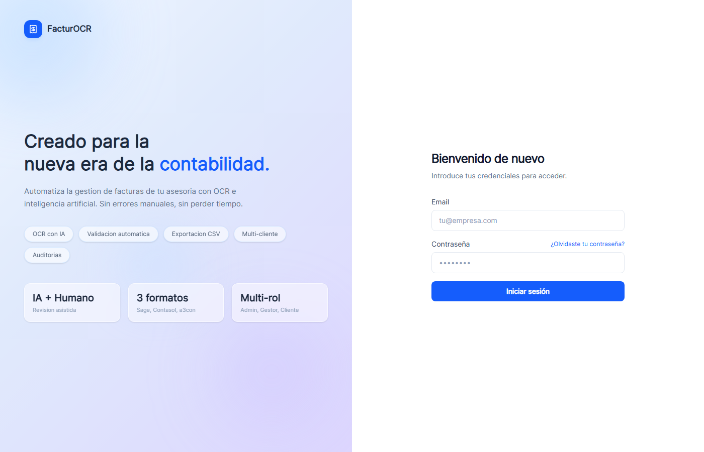

### 6.2 Admin

| # | Ruta | Objetivo | Elementos principales |
|---|------|----------|----------------------|
| 02 | `/dashboard/admin` | Panel general con KPIs de la firma | Cards (facturas totales, pendientes, validadas, rechazadas), facturas recientes, progreso por cliente |
| 03 | `/dashboard/admin/clients` | Listado y alta de clientes | Tabla con búsqueda, CTA "Nuevo cliente", badge de workers asignados |
| —  | `/dashboard/admin/clients/[id]` | Detalle de cliente | Info, workers, facturas recientes, acceso a plan de cuentas |
| —  | `/dashboard/admin/clients/[id]/accounts` | Plan de cuentas | Tabla NIF/nombre/cuenta proveedor/cuenta gasto/IVA, import Excel |
| 04 | `/dashboard/admin/workers` | Listado de gestores | Tabla, CTA "Nuevo gestor" |
| —  | `/dashboard/admin/workers/[id]` | Detalle de gestor (nuevo) | Stats, `AssignmentsPanel` para marcar clientes, `DeleteWorkerButton` |
| 05 | `/dashboard/admin/invoices` | Tabla de facturas de toda la firma | Filtros por estado/tipo, paginación, bulk validate |
| —  | `/dashboard/admin/invoices/[id]` | Detalle + historial + audit | PDF viewer, datos, `InvoiceStatusHistory`, `AuditLog` |
| —  | `/dashboard/admin/batch` | Lotes agrupados por cliente+periodo | Barra de progreso por estado, CTA "Revisar" |
| 06 | `/dashboard/admin/export` | Exportación a programa contable | Selector cliente/periodo/formato/tipo, preview, historial |
| 07 | `/dashboard/admin/closures` | Cierres de periodo | Listado por cliente, botones cerrar/reabrir, historial |
| 08 | `/dashboard/admin/audit` | Auditoría de cambios | Filtros, últimos 200 registros |
| 09 | `/dashboard/admin/settings` | Ajustes firma y perfil | Datos de firma, cambio contraseña, perfil |

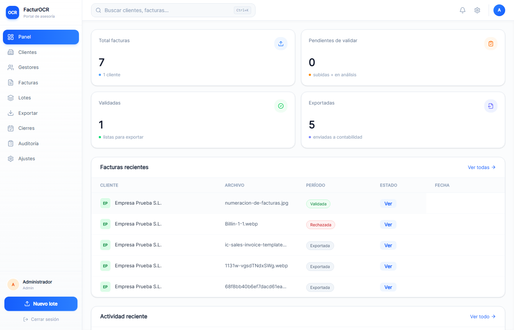
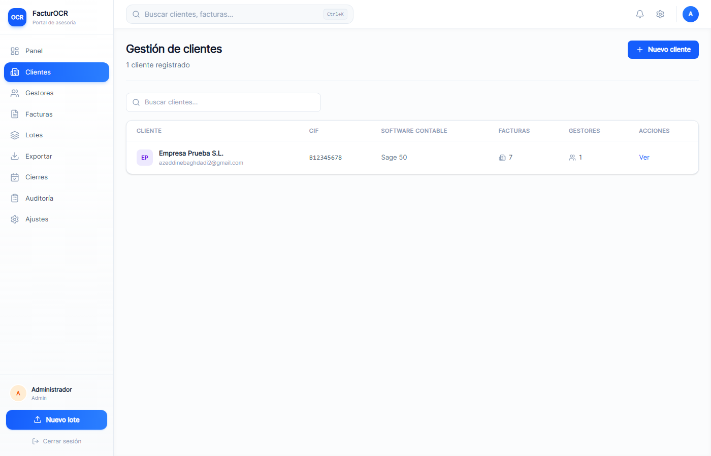
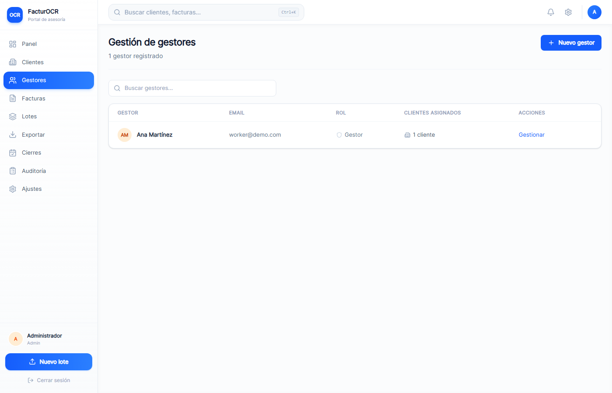
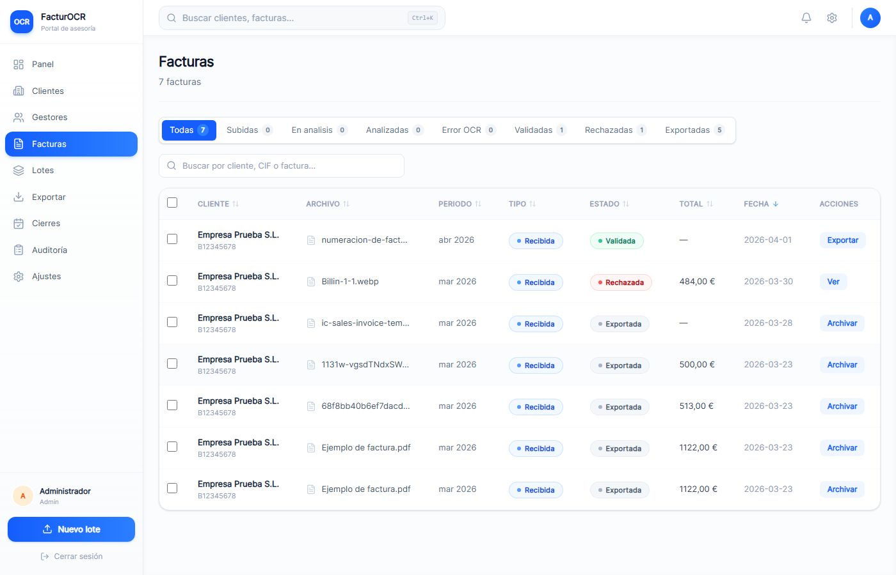
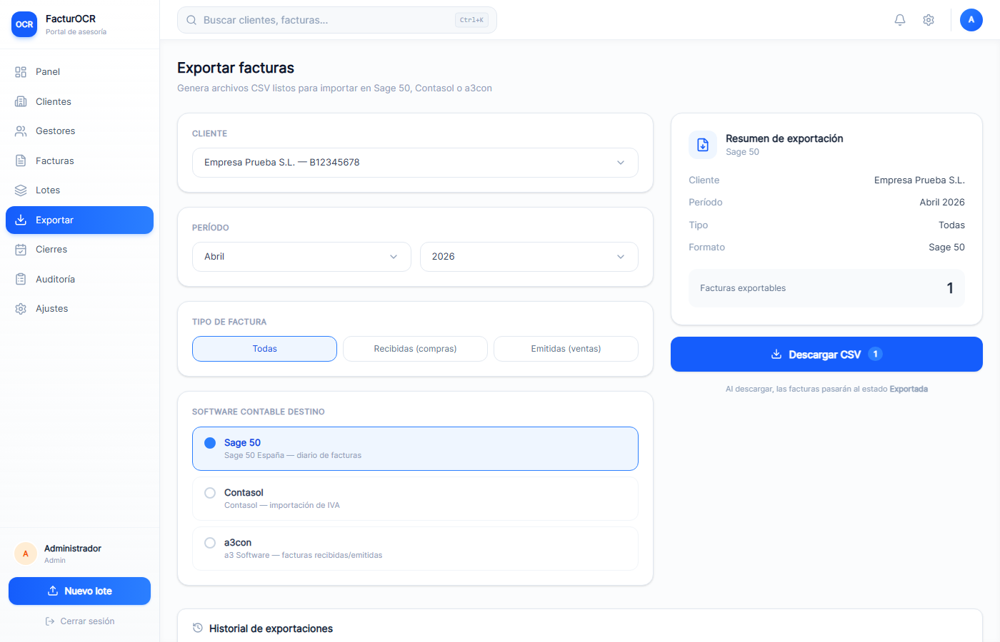
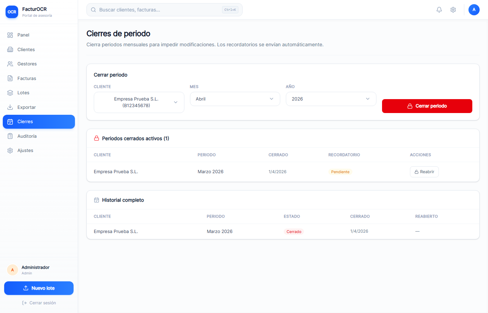
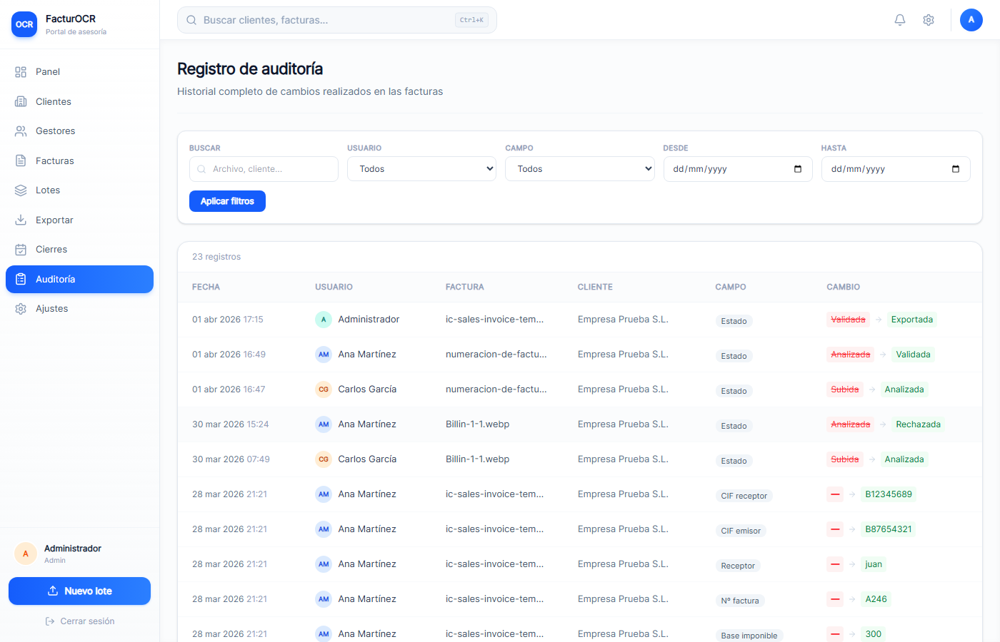
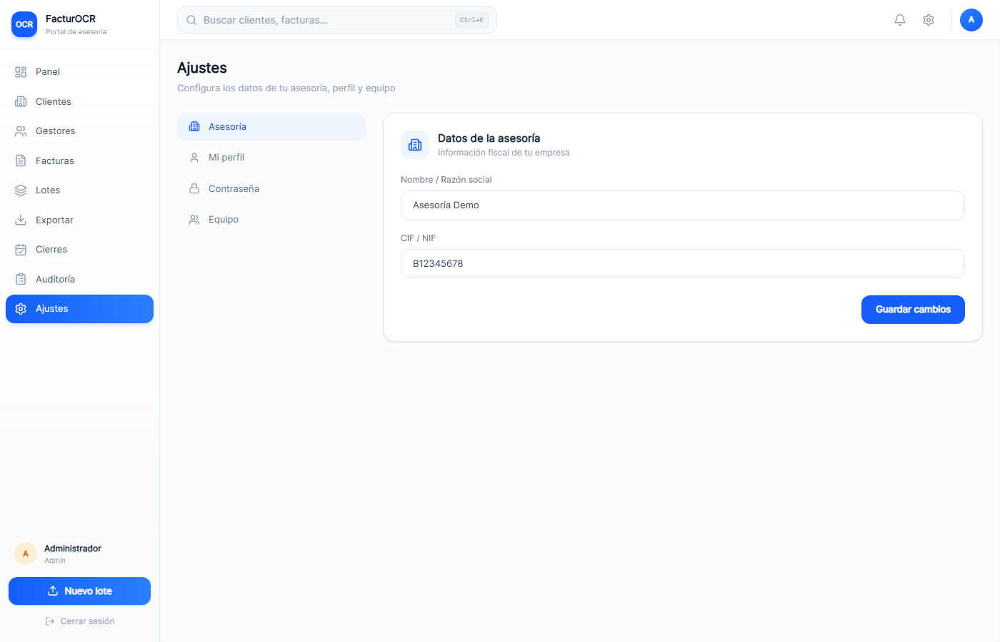

### 6.3 Worker (gestor)

| # | Ruta | Objetivo | Elementos principales |
|---|------|----------|----------------------|
| 10 | `/dashboard/worker` | Panel del gestor | KPIs limitados a clientes asignados, facturas recientes |
| —  | `/dashboard/worker/clients` | Lista de clientes asignados | Cards por cliente |
| —  | `/dashboard/worker/clients/[id]` (nuevo) | Detalle de cliente para worker | Info, gestores co-asignados, 10 facturas recientes, link a listado completo |
| 11 | `/dashboard/worker/invoices` | Tabla facturas (scope asignación) | Filtro por cliente |
| 12 | `/dashboard/worker/upload` | Subida de facturas por el gestor | Selector cliente/periodo/tipo, drag-drop |
| —  | `/dashboard/worker/batch` | Lotes (solo clientes asignados) | Agrupación+progreso |
| **13** | `/dashboard/worker/review/[id]` | **Revisión OCR** (split PDF + formulario) | PDF viewer, form editable, confidence badges, validación matemática, navegación secuencial, cuentas contables |
| —  | `/dashboard/worker/issues` | Incidencias abiertas | Listado con acciones resolver/descartar |

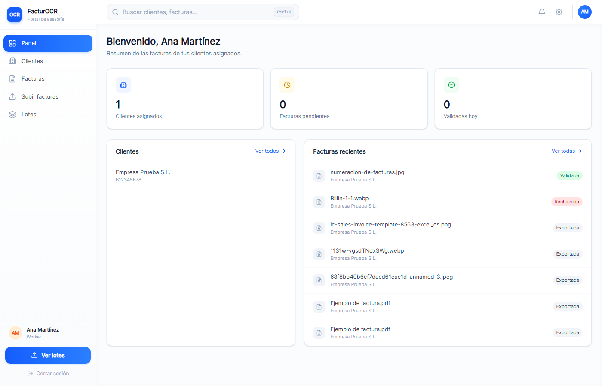
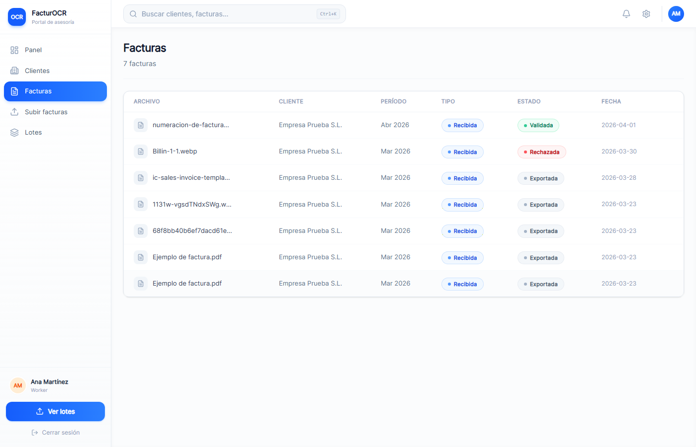
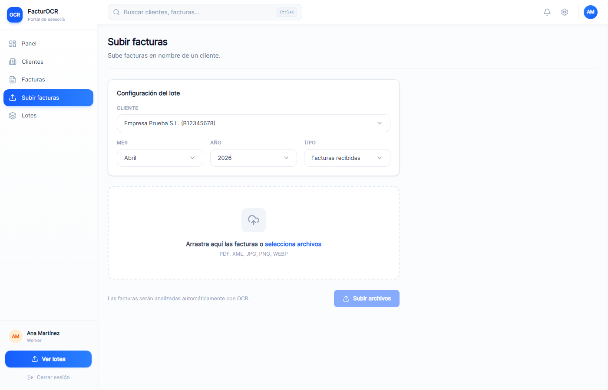

> **Limitación observada**: no existe captura #13 para la pantalla de revisión OCR del worker (`/dashboard/worker/review/[id]`). Esta es la pantalla central del flujo operativo; debería añadirse a `docs/screenshots_v2/` como `13_worker_review.png`.

### 6.4 Client (cliente final)

| # | Ruta | Objetivo | Elementos principales |
|---|------|----------|----------------------|
| 14 | `/dashboard/client` | Panel propio | Stats propias, CTA "Subir factura", facturas recientes |
| 15 | `/dashboard/client/invoices` | Tabla facturas propias | Estado, motivo de rechazo, botón re-subir |
| 16 | `/dashboard/client/upload` | Subida por el cliente | Selector periodo/tipo, drag-drop (sin selector de cliente) |

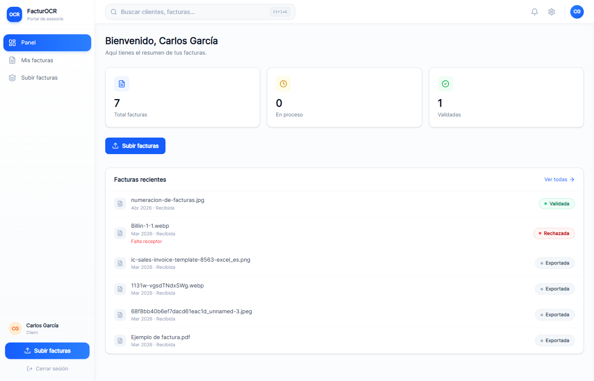
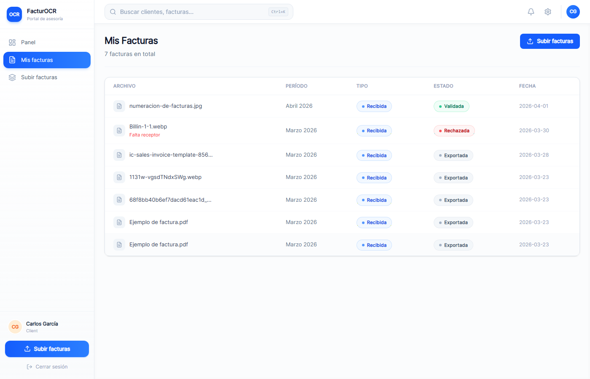
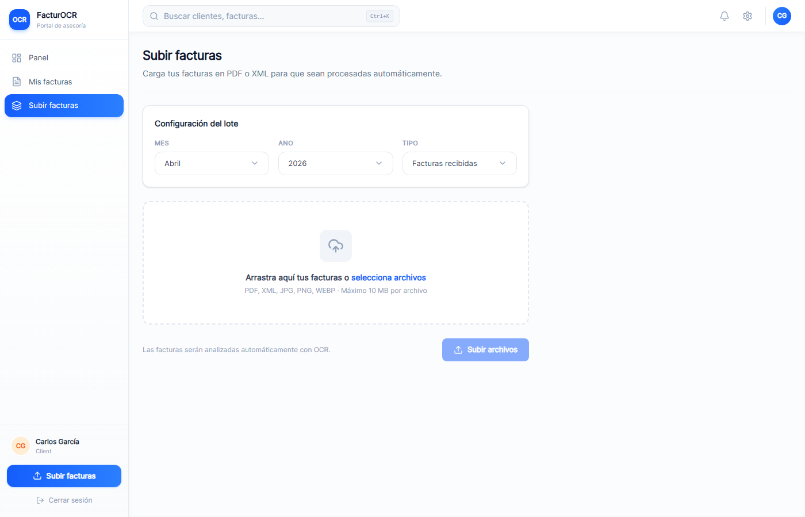

---

## 7. Flujo operativo completo

El flujo canónico de una factura atraviesa tres roles. A continuación, paso a paso, con referencias a código y capturas.

### Paso 1 — Subida por el cliente

El cliente entra en `/dashboard/client/upload` (captura 16), selecciona periodo y tipo (compra/venta), arrastra o selecciona los archivos y pulsa "Subir".

Server side (`src/app/dashboard/client/upload/actions.ts`):

1. Verifica que el usuario es CLIENT y resuelve su `Client` por `userId`.
2. Valida que el periodo no esté cerrado (`PeriodClosure`).
3. Por cada archivo:
   - Valida magic bytes (`detectFileKind`).
   - Calcula SHA-256; si ya existe `Invoice` con el mismo `fileHash` para ese cliente, se omite.
   - Sube a Supabase Storage.
   - Crea `Document` + `Invoice` (status `UPLOADED`).
4. Dispara `after(() => processInvoice(invoiceId, userId))`.

El cliente queda con el estado UPLOADED visible hasta que el cron o la respuesta del OCR lo actualice.

### Paso 2 — Procesamiento OCR automático

`src/lib/processInvoice.ts`:

1. Transición atómica `UPLOADED → ANALYZING`.
2. Descarga del archivo.
3. Llamada a Document AI (PDF/imagen) o parse XML.
4. Validación matemática.
5. Creación de `InvoiceExtraction` con datos OCR + confidence + timings.
6. `detectIssues(...)` detecta duplicados / baja confianza / math mismatch.
7. Copia de datos a `Invoice` + transición a `PENDING_REVIEW` (sin incidencias) o `NEEDS_ATTENTION` (con).
8. En caso de error: `OCR_ERROR` con `lastOcrError`.

Los workers asignados al cliente reciben un email ("Nuevas facturas") si hay facturas nuevas por subida del cliente.

### Paso 3 — Revisión por el gestor

El gestor entra en `/dashboard/worker/invoices` (captura 11), filtra por cliente si quiere, y pulsa en una factura. Eso le lleva a `/dashboard/worker/review/[id]` (captura #13, ausente).

Allí ve:

- El PDF a la izquierda (signed URL 10 min).
- El formulario a la derecha con datos OCR pre-rellenados.
- Badges de confianza por campo.
- Semáforo Base + IVA = Total.
- Si el CIF emisor ya existe en el plan de cuentas del cliente, las cuentas contables se sugieren.

El gestor corrige lo necesario y pulsa **Validar** o **Rechazar**.

- Validar → status `VALIDATED`, email al cliente, upsert en `AccountEntry` (aprendizaje), entrada en `InvoiceStatusHistory` + `AuditLog`, redirige a la siguiente factura del lote si hay.
- Rechazar → status `REJECTED` con motivo y categoría, email al cliente que puede re-subir.

### Paso 4 — Cliente re-sube factura rechazada (opcional)

En `/dashboard/client/invoices` el cliente ve el motivo y pulsa "Re-subir". Se crea una nueva `Invoice` con `replacesId` apuntando a la rechazada. La original queda como REJECTED con link al reemplazo.

### Paso 5 — Cierre de periodo y exportación

Cuando todas las facturas del periodo están VALIDATED, el admin va a `/dashboard/admin/export` (captura 06), elige cliente + mes/año + formato + tipo. Pulsa preview, confirma y descarga.

Se crea `ExportBatch` + `ExportBatchItem` (snapshot JSON), se vincula cada factura al batch, se registra `AuditLog`. El fichero se descarga (CSV o XLSX A3).

Finalmente, desde `/dashboard/admin/closures` (captura 07), el admin cierra el periodo para ese cliente. Eso bloquea modificaciones a facturas de ese mes/año.

### Paso 6 — Auditoría

En `/dashboard/admin/audit` (captura 08) el admin puede filtrar por usuario, campo o fecha y ver los últimos 200 cambios realizados.

---

## 8. Demo guiada end-to-end

Esta es la secuencia recomendada para mostrar el producto a un evaluador en ~10 minutos. Se asume que `scripts/seed-demo.ts` se ha ejecutado con `SEED_CONFIRM=yes`, que existe un admin `admin@demo.com / Demo1234!`, dos gestores y dos clientes demo con facturas y PDFs reales en Supabase.

### Minuto 1 — Login

- Entrar con `admin@demo.com / Demo1234!` desde la pantalla de login (captura 01).
- Comentar: JWT de 8h, bloqueo a 3 intentos, rate limiting 10/15 min.


### Minuto 2 — Panel admin

- Captura 02: mostrar KPIs, facturas recientes, progreso por cliente.
- Explicar aislamiento multi-tenant (solo ve su `AdvisoryFirm`).


### Minuto 3 — Clientes y gestores

- Captura 03 (clientes): abrir uno → detalle → abrir plan de cuentas.
- Captura 04 (gestores): abrir uno → detalle (ruta nueva `admin/workers/[id]`) → asignar/desasignar cliente con `AssignmentsPanel`.


### Minuto 4 — Subida como cliente

- Logout y login como cliente demo.
- Ir a captura 16 (`/dashboard/client/upload`): subir uno de los PDFs de `scripts/demo-pdfs/`.
- Mostrar en captura 15 que la factura aparece como UPLOADED → ANALYZING → PENDING_REVIEW.


### Minuto 5–6 — Revisión como gestor

- Logout y login como worker demo.
- Ir a captura 11 (`/dashboard/worker/invoices`), filtrar por el cliente, abrir la factura recién subida.
- Pantalla de revisión (captura #13 pendiente): mostrar split PDF + formulario, badges de confianza, semáforo matemático.
- Explicar que, al validar, se aprende el plan de cuentas: la próxima factura del mismo emisor traerá las cuentas contables auto-rellenadas.
- Validar la factura.


### Minuto 7 — Incidencias

- Abrir una factura NEEDS_ATTENTION del seed, ver incidencias detectadas (duplicado o descuadre), resolver o rechazar.

### Minuto 8 — Exportación

- Logout y login como admin otra vez.
- Captura 06 (`/dashboard/admin/export`): elegir cliente + mes + A3 Excel, preview, exportar. Descargar XLSX con dos hojas (recibidas / expedidas).


### Minuto 9 — Cierre y auditoría

- Captura 07 (`/dashboard/admin/closures`): cerrar el periodo del cliente.
- Captura 08 (`/dashboard/admin/audit`): filtrar por el worker y ver los cambios que hizo durante la revisión.


### Minuto 10 — Ajustes y despedida

- Captura 09 (`/dashboard/admin/settings`): mostrar ajustes de firma, cambio de contraseña.


---

## 9. Capturas comentadas

Resumen de las 15 capturas disponibles, una por una.

### 01 — Login


Pantalla limpia con formulario email + contraseña, logo FacturOCR y enlace "¿Olvidaste tu contraseña?". Validación Zod client-side y server-side, mensaje unificado "Email o contraseña incorrectos" para no filtrar qué cuenta existe, y mensaje específico cuando la cuenta está bloqueada por intentos fallidos o rate limit.

### 02 — Panel admin


Dashboard con KPIs (totales, pendientes, validadas, rechazadas), tabla de facturas recientes y barras de progreso por cliente. Todos los datos están `scoped` por `advisoryFirmId` de la firma del admin.

### 03 — Admin: clientes


Listado de clientes de la firma con buscador client-side. Cada fila lleva a `/admin/clients/[id]`. El botón "Nuevo cliente" abre un formulario que valida CIF con checksum y envía email de invitación al cliente final con token (72 h).

### 04 — Admin: gestores


Listado de `User.role = WORKER` de la firma, con el número de clientes asignados. Al abrir un gestor se accede a la pantalla de detalle (ruta nueva `admin/workers/[id]/page.tsx`) donde aparece `AssignmentsPanel` para marcar/desmarcar clientes y `DeleteWorkerButton` (solo habilitado si el gestor no tiene clientes asignados).

### 05 — Admin: facturas


Tabla completa de facturas de la firma con filtros por estado e tipo, paginación y acción "Validar seleccionadas". Columnas: filename, cliente, periodo, tipo, estado (badge con label de `STATUS_LABELS`), importe, acciones.

### 06 — Admin: exportar


Formulario de exportación con cliente + periodo + formato + tipo, y panel lateral con historial de `ExportBatch` generados. Preview indica cuántas facturas VALIDATED se incluirán. La exportación crea `ExportBatchItem` con snapshot por factura.

### 07 — Admin: cierres


Listado de cierres por cliente con acciones cerrar / reabrir. El cron mensual `closure-reminders` envía recordatorio a los clientes con el mes anterior sin cerrar.

### 08 — Admin: auditoría


Tabla de los últimos 200 `AuditLog`, filtrable por usuario, campo y rango de fechas. Cada registro muestra el valor antiguo, el nuevo y quién y cuándo hizo el cambio.

### 09 — Admin: ajustes


Ajustes con tres bloques: datos de la firma (`AdvisoryFirm`: nombre, CIF), cambio de contraseña, datos personales. Todo pasa por server actions con validación Zod.

### 10 — Worker: panel


Dashboard scoped al worker: solo ve clientes asignados y sus facturas. KPIs de pendientes, validadas hoy, rechazadas.

### 11 — Worker: facturas


Tabla de facturas filtrable por cliente (query `?clientId=...`). Desde aquí el gestor entra a revisión.

### 12 — Worker: subir


Formulario de subida con selector de cliente (solo los asignados), periodo y tipo, y drag-and-drop multi-archivo. Incluye validación de magic bytes, deduplicación por SHA-256 y chequeo de periodo cerrado antes de subir.

### 13 — Worker: revisión OCR

> **Captura ausente**. Esta es la pantalla central del producto (`/dashboard/worker/review/[id]`), con split-screen PDF + formulario. Funciona y está cubierta por tests, pero falta la captura en `docs/screenshots_v2/`.

### 14 — Client: panel


Dashboard propio del cliente final: KPIs de sus facturas, CTA "Subir factura" y listado de las últimas subidas.

### 15 — Client: facturas


Listado de facturas del cliente con estado y, si están REJECTED, motivo y botón "Re-subir" que crea una nueva `Invoice` con `replacesId`.

### 16 — Client: subir


Formulario simplificado (sin selector de cliente) con periodo, tipo y drag-and-drop.

---

## 10. Estado actual real

### 10.1 Implementado y verificado en código

- Autenticación JWT con lockout y rate limiting.
- RBAC con 3 roles y aislamiento multi-tenant por firma, asignación y `userId`.
- Subida con magic bytes, SHA-256 dedup, cierre de periodo y Supabase Storage.
- OCR pipeline con Document AI + FacturaE XML, estado atómico, reintentos.
- Detección de incidencias (4 tipos automáticos + manual).
- Revisión con optimistic locking, audit log por campo, aprendizaje de plan de cuentas en `AccountEntry` al validar.
- Re-subida de facturas rechazadas (`replacesId`).
- Exportación a Sage 50 / Contasol / A3CON (CSV) + A3 Excel (XLSX) con snapshot por batch.
- Cierres de periodo reversibles con cron de recordatorio.
- Auditoría con filtros.
- Emails Resend (6 plantillas) con anti-XSS y fallback a consola en dev.
- Headers de seguridad: CSP, X-Frame-Options, X-Content-Type-Options, Referrer-Policy, Permissions-Policy, HSTS (producción).
- Body limit Server Actions 25 MB.
- Session JWT 8h/1h.
- Vitest unit (55) + Playwright smoke (5) + seed demo con PDFs reales.
- Páginas detalle de gestor (`admin/workers/[id]`) y detalle cliente-para-worker (`worker/clients/[id]`).

### 10.2 Dependencia por rol

Las siguientes capacidades están gateadas por rol en el código y en la navegación:

| Capacidad | ADMIN | WORKER | CLIENT |
|-----------|:-----:|:------:|:------:|
| Dashboard | Sí (firma) | Sí (asignados) | Sí (propio) |
| CRUD clientes | Sí | — | — |
| Plan de cuentas (CRUD) | Sí | — | — |
| CRUD gestores | Sí | — | — |
| Asignar clientes a gestor | Sí | — | — |
| Detalle cliente | Sí | Sí (solo asignados) | Sí (propio) |
| Subir factura | Sí (cualquiera de firma) | Sí (asignados) | Sí (propio) |
| Revisar / validar / rechazar | Sí | Sí (asignados) | — |
| Incidencias | Sí | Sí (asignados) | — |
| Exportar | Sí | — | — |
| Cierres periodo | Sí | — | — |
| Auditoría | Sí | — | — |
| Ajustes firma | Sí | — | — |
| Re-subir factura rechazada | — | — | Sí |
| Búsqueda global (scope) | Firma | Asignados | Propios |

---

## 11. Limitaciones observadas

Solo se listan puntos detectados directamente en la revisión del código o del material:

1. **Falta captura #13 (`/dashboard/worker/review/[id]`)**. Es la pantalla central del producto. El código está presente y funciona, pero `docs/screenshots_v2/` no contiene `13_worker_review.png`. Cualquier material comercial o documental que dependa de estas capturas tiene una laguna visual precisamente en el paso que mejor muestra el valor del OCR.
2. **IRPF no extraído en PDF/imagen**. Google Document AI Invoice Parser no devuelve IRPF; el gestor debe introducirlo manualmente en la revisión. Sí se extrae correctamente desde XML FacturaE.
3. **Rate limiter en memoria**. `src/lib/rateLimit.ts` usa un `Map` en proceso. Funciona en single-instance (MVP en Vercel), pero pierde estado con escalado horizontal.
4. **Seed demo acoplado a Python**. `scripts/seed-demo.ts` invoca `gen-sample-invoice.py` (reportlab). Requiere que `python` esté en el PATH del entorno para generar PDFs — confirmado en comentarios del propio script.
5. **Legacy enum values**. Los estados `ANALYZED` y `EXPORTED` permanecen en `InvoiceStatus` por compatibilidad histórica; el código actual no los escribe, pero cualquier factura vieja en BD puede tenerlos. `src/lib/invoiceStatuses.ts` los trata como draft/done respectivamente para la UI.
6. **Tamaño máximo de archivo**. Server Actions están configuradas a 25 MB (`next.config.ts`). Facturas grandes multipágina por encima de ese tamaño se rechazarían en el propio Next.js antes de llegar a validación.
7. **Funcionalidades del informe previo no verificadas en esta revisión**: los puntos de accesibilidad y responsive detallados en `INFORME_PRODUCTO_COMPLETO.md` (ARIA labels, comportamiento de split en móvil, etc.) no se han re-verificado aquí; se mantiene su descripción como **"documentada pero no verificada en esta revisión"**.

---

## 12. Conclusión final

FacturOCR es hoy un producto funcional de principio a fin: desde que un cliente sube una factura en su portal hasta que el admin de la asesoría genera el fichero de importación para su programa contable. El pipeline OCR, la revisión editorial, la exportación multi-formato, el aprendizaje del plan de cuentas, la trazabilidad (audit log + status history + snapshots de exportación), los cierres de periodo, la auditoría, y el aislamiento multi-tenant están implementados y cubiertos por tests automatizados.

Respecto al informe previo (14 de abril), la revisión del 20 de abril verifica las incorporaciones siguientes:

- Páginas de detalle para gestores (`admin/workers/[id]`) con panel de asignaciones y borrado seguro, y de cliente-para-worker (`worker/clients/[id]`).
- Aprendizaje automático del plan de cuentas al validar factura (upsert en `AccountEntry`).
- Seed demo reproducible con PDFs reales generados y subidos a Supabase.
- Batería de tests: 55 unit (Vitest) y 5 smoke (Playwright).
- Límite de body de Server Actions elevado a 25 MB.
- Rate limiting en login y reset-password, CSP completa, HSTS en producción, validación de magic bytes en uploads, session JWT con `maxAge: 8h`.

El estado actual es adecuado para demos con clientes reales y para despliegue en entorno pre-productivo con usuarios beta. La única laguna inmediata en los materiales de producto es la ausencia de la captura #13 del flujo de revisión OCR, precisamente la pantalla que mejor ilustra el valor del producto.

---

*Informe generado el 20 de abril de 2026 a partir del repositorio `invoice-saas` y de las capturas en `docs/screenshots_v2/`. Verificado contra `prisma/schema.prisma`, `src/app/dashboard/**`, `src/lib/` y `scripts/seed-demo.ts`.*
